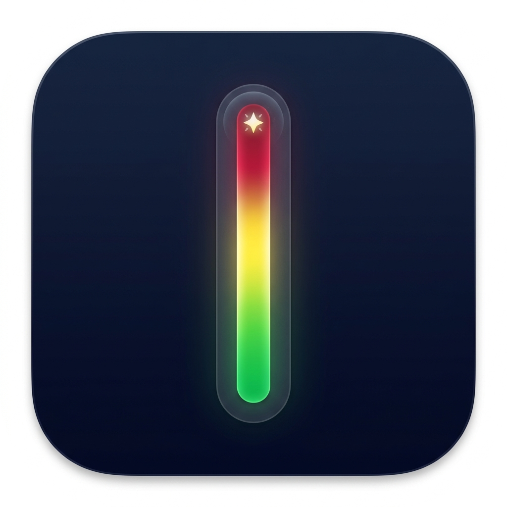
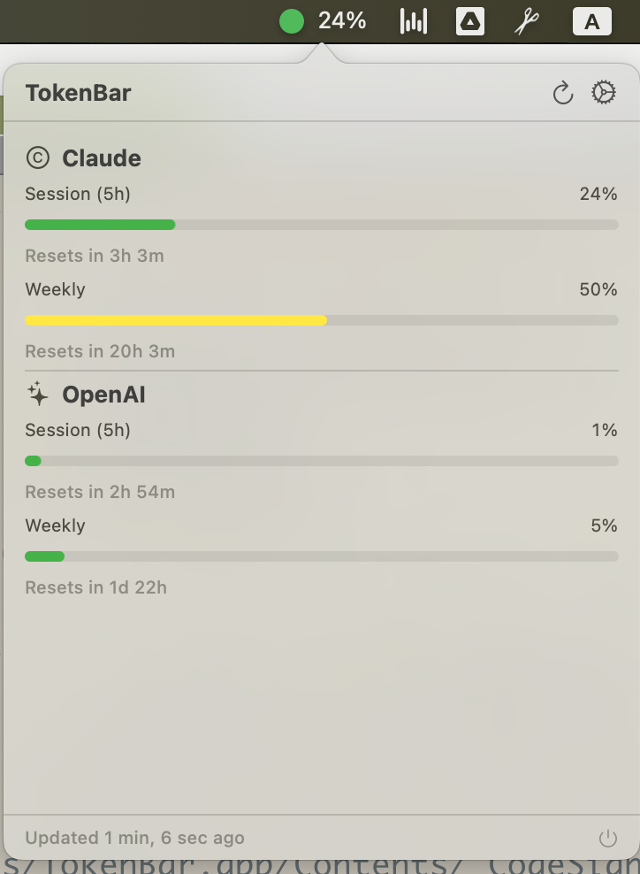
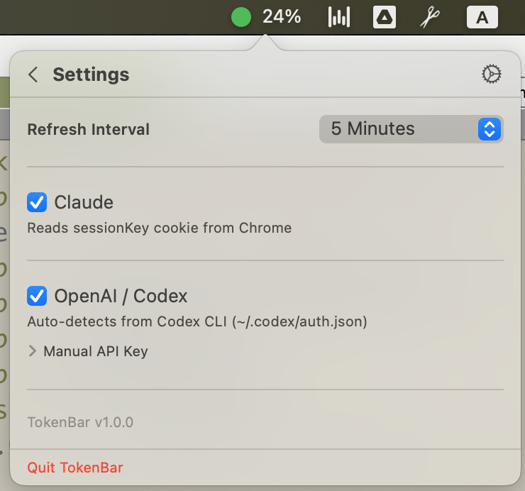

# Simple Token Bar

<p align="center">
  
</p>

A lightweight macOS menu bar app that monitors AI provider token and credit usage. Inspired by [CodexBar](https://github.com/steipete/CodexBar).

<p align="center">
  
  
</p>

## Features

- **Menu bar icon** with color-coded usage indicator (green < 50%, yellow 50-80%, red > 80%)
- **Claude** — session (5h) and weekly (7d) usage meters with reset countdowns, auto-detected via browser cookies
- **OpenAI / Codex** — session and weekly usage meters via Codex CLI RPC, with OAuth and API key fallbacks
- **Inline settings** — configure providers, refresh interval, and API keys directly in the popover
- **CLI tool** — `tokenbar status --json` for scripting and CI integration
- **Privacy-first** — all data stays on-device, no telemetry, browser cookie access is opt-in

## Requirements

- macOS 14 (Sonoma) or later
- For Claude: logged into [claude.ai](https://claude.ai) in Chrome
- For OpenAI/Codex: [Codex CLI](https://github.com/openai/codex) installed and logged in (`codex login`)

## Installation

### From Source

```bash
git clone https://github.com/nickeltin/simple-token-bar.git
cd simple-token-bar

# Build and package the app
bash scripts/package_app.sh

# Install to Applications
rm -rf "/Applications/Simple Token Bar.app"
cp -r "Simple Token Bar.app" /Applications/

# Launch
open "/Applications/Simple Token Bar.app"
```

### CLI Tool

The CLI is bundled inside the app:

```bash
# Symlink to PATH
ln -sf "/Applications/Simple Token Bar.app/Contents/MacOS/tokenbar-cli" /usr/local/bin/tokenbar

# Usage
tokenbar status              # human-readable table
tokenbar status --json       # JSON output
tokenbar providers           # list configured providers
```

### Auto-Start on Login

System Settings > General > Login Items > add Simple Token Bar

## How It Works

### Claude

Simple Token Bar reads the `sessionKey` cookie from Chrome (domain: `claude.ai`) and queries:
- `GET claude.ai/api/organizations` — resolve org UUID
- `GET claude.ai/api/organizations/{uuid}/usage` — 5-hour and 7-day utilization
- `GET claude.ai/api/organizations/{uuid}/overage_spend_limit` — credit balance

No API key needed — just be logged into claude.ai in Chrome.

### OpenAI / Codex

Simple Token Bar uses a 3-tier authentication strategy:

1. **API Key** (if configured in Settings) — queries OpenAI billing endpoints
2. **Codex CLI RPC** — launches `codex app-server` and queries rate limits via JSON-RPC (same approach as CodexBar)
3. **OAuth fallback** — reads `~/.codex/auth.json` (created by `codex login`) and queries `/v1/me` for account info

For full usage meters (session + weekly), make sure Codex CLI is installed and logged in.

## Tech Stack

- **Swift 6** with strict concurrency
- **SwiftUI** + **AppKit** (NSStatusBar, NSPopover)
- **Swift Package Manager** with 3 targets: TokenBarCore, TokenBar, TokenBarCLI
- **SweetCookieKit** for browser cookie extraction
- **swift-argument-parser** for CLI
- **swift-log** for structured logging

## Project Structure

```
Sources/
  TokenBarCore/          Shared library (models, fetchers, managers)
    Models/              RateWindow, UsageSnapshot, CreditsSnapshot, etc.
    Providers/Claude/    ClaudeWebFetcher (cookie-based)
    Providers/OpenAI/    OpenAIAPIFetcher, CodexCLIFetcher, OAuth
    Cookies/             BrowserCookieManager (SweetCookieKit)
    Keychain/            KeychainManager (Security framework)
  TokenBar/              macOS menu bar app
    App/                 AppDelegate, TokenBarApp
    MenuBar/             StatusItemController, PopoverController
    Views/               SwiftUI views (popover, meters, settings)
    Services/            UsagePollingService
  TokenBarCLI/           CLI tool (tokenbar)
Tests/
  TokenBarCoreTests/     25 unit tests
scripts/
  package_app.sh         Build and package Simple Token Bar.app
```

## Development

```bash
# Build (debug)
swift build

# Run app (debug)
swift run TokenBar

# Run CLI
swift run tokenbar status --json

# Run tests
swift test

# Build release app
bash scripts/package_app.sh
```

## Acknowledgments

Inspired by [CodexBar](https://github.com/steipete/CodexBar) by Peter Steinberger. Simple Token Bar is a clean-room rewrite — no code was copied, but the concept, provider API endpoints, and Codex CLI RPC approach are referenced from CodexBar's architecture.

## License

MIT
